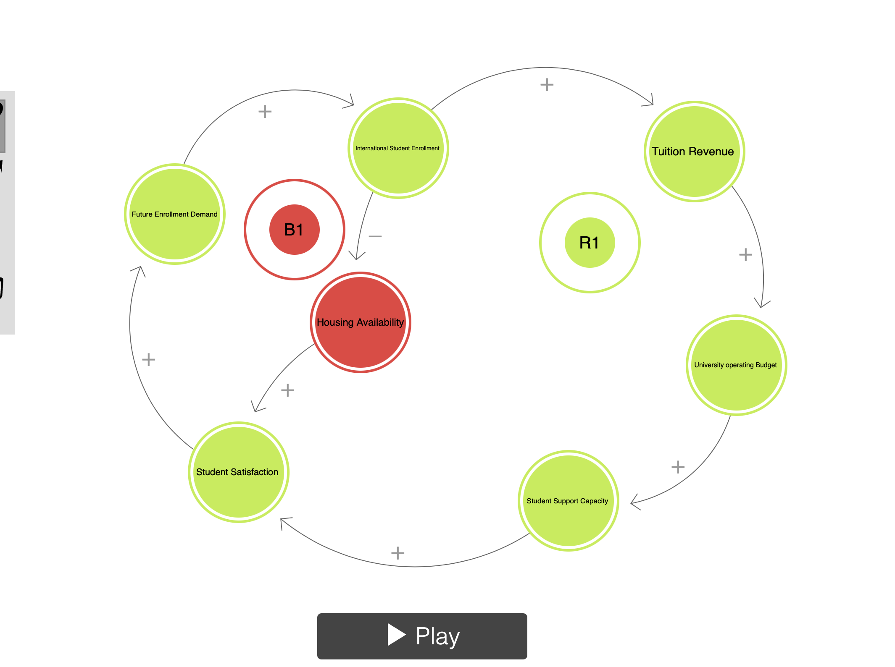

# International-Enrollment-and-University-Sustainability
This repository contains information on international student enrollment and examines how housing limits and tuition reliance shape university sustainability.

> [!TIP]
> See markdown cheatsheet on moodle.

*Decision Statement:* Should the Nova Scotia Minister of Advanced Education reduce international student enrollment at public universities due to housing shortages and tuition dependency?

> [!WARNING]
> This might be hard to prove or answer because it would require you to have data on international student housing - who lives where ,and who couldn't get a place as a result (if true) - it's a counterfacual you probably can't answer.  

> [!TIP]
> Consider asking instead: Where should the minister of advanced educ. invest in housing support - where is the international student pressure that is also low rental availability.  CMHC data has some data on this.

Decision Maker: Nova Scotia Minister of Advanced Education 

## Executive Summary: 

Universities in Nova Scotia depend on international Students because they are a key source of tuition revenue. International enrollment has grown at a faster rate than domestic enrollment, which helps universities cover expenses. However, this growth has increased pressure on housing, student services, and acadmic capacity.

Many students struggle to find affordable housing, which can affect their well-being and ability to stay in university. Also, changes to immigration and study permit policies makes it harder to rely on international students. Which raises the question can these current enrollment levels be maintained?

This project helps the Nova Scotia Minister of Advanced Education decide if international student enrollment at public universities be adjusted. By examining enrollment trends, tuition dependency, and housing shortages.

Data Pool: Education & Labour 

## Casual Loop Diagram Overview:

Some of the key loops include the reinforcing loop that shows the more enrollment increases tuition revenue, which increases the university operating budget as well as student support services which all leads to a higher future enrollment. A balancing loop that shows where  higher enrollment reduces housing availbility and lowers student satisfaction.

