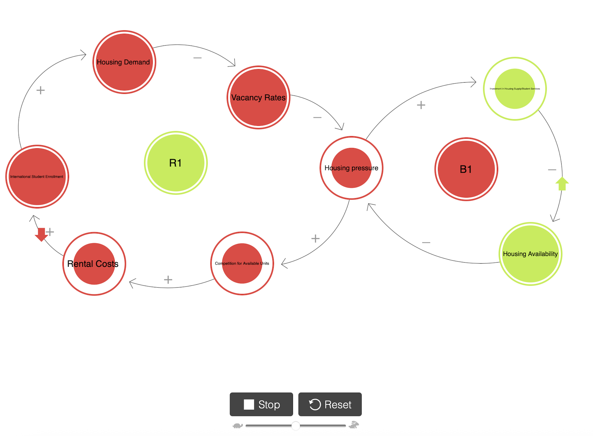

# International-Enrollment-and-University-Sustainability
This repository contains information on international student enrollment, availability, and long-term university sustainability in Nova Scotia, with a particular focus in Halifax because it is heavily saturated with universities and university students.

## Decision Statement:

Should the Nova Scotia Minister of Advanced Education reduce international student enrollment at public universities or prioritize targeted housing investments to address increasing housing pressure in high demand regions across Nova Scotia.

## Decision Maker: 

Nova Scotia Minister of Advanced Education 

## Executive Summary: 

Universities in Nova Scotia rely heavily on international students as a primary source of tuition revenue. As international enrollment grows, institutions strengthen their financial position and expands their academic and student support services. However this growth has also intensified pressure on housing systems, especially in Halifax where student demand is highly concentrated.

This project applies a systems thinking approach using the Growth and Underinvestment archetype to explain how increasing enrollment drives higher housing demand, reduces vacancy rates, and contributes to rising rental costs. Although increased housing pressure should prompt investment in additional supply, delays in planning, approvals, and construction limit the system's ability to respond effectively in the short term. As a result, housing shortages persist and they continue to increase.

The analysis evaluates two policy approaches. First, address the issue in Halifax by investing heavily into housing, or distribute housing support evenly across multiple university centers, including Antigonish and Cape Breton. While Both strategies contribute to gradual improvement, targeted investment in Halifax is more effective in reducing system wide housing pressure and improving long term sustainability.

## Table of Contents
- [Decision Statement](#decision-statement)
- [Executive Summary](#executive-summary)
- [Background](./Background.md#international-student-enrollement-in-nova-scotia)
- [Data Sources](./Data/README.md#university-enrollment-dataset)
- [Data Wrangling](./Wrangling.md#data-wrangling-process)
- [Exploratory Findings](#explatory-findings)
- [System Dynamics(Causal Loop Diagram)](#final-causal-loop-diagram-overview)
- [Analysis](#analysis)
- [Decision Recommendations](#decision-recommandations)
- [Limitations and Future Work](#limitations-and-future-work)
- [References](#references)

## Data Pool: 

Education & Labour 

# Explatory FIndings 

## Visualization 1: Graph showing the Geographic Distribution of Housing Pressure

This geographic map illustrates how student housing pressure is distributed across different regions in Nova Scotia. Each circle represents a specific centre, with the size of the circle corresponding to total student enrollment and the color indicating the level of housing pressure. Darker colors represent higher levels of pressure, while lighter colors indicate lower pressure.

Halifax stands out clearly on this map, as it has both the largest circle and the darkest shading. This indicates that Halifax not only has the highest concentration of students but also faces the most significant housing constraints. The combination of high demand and limited housing supply results in intense competition for available units. In contrast, regions such as Antigonish and Cape Breton display smaller circles and lighter colors, suggesting that while student populations exist in these areas, the pressure on housing markets is considerably lower.

This visualization highlights an important spatial imbalance in housing demand across the province. Rather than being evenly distributed, housing pressure is heavily concentrated in urban centres, particularly Halifax. This suggests that policy interventions and housing investments should be geographically targeted, with a primary focus on high-demand areas. Without addressing this imbalance, students in these regions will likely continue to face difficulty securing affordable and available housing.

## Visualization 2: Relationship between Enrollment and Vacancy Rates

This scatter plot examines the relationship between student enrollment and housing vacancy rates across different centres in Nova Scotia. Each point represents a region, with the horizontal axis showing the number of students and the vertical axis representing the vacancy rate.

The overall pattern of the data suggests a negative relationship between enrollment and vacancy rates. Regions with higher student populations, such as Halifax, tend to have lower vacancy rates, indicating tighter housing markets. Halifax is positioned far to the right of the graph due to its large student population, yet its vacancy rate remains relatively low. This combination suggests that housing supply is not keeping pace with demand, resulting in increased competition among students for available units.

On the other hand, regions with smaller student populations generally show slightly higher vacancy rates, indicating that housing availability is less constrained in those areas. This contrast reinforces the idea that student demand is a key driver of housing pressure. As enrollment increases in a region, available housing becomes more limited unless supply expands accordingly.

This visualization is important because it provides evidence of a structural relationship between student population growth and housing availability. It supports the argument that rising enrollment without corresponding increases in housing supply can lead to shortages, particularly in already high-demand areas like Halifax.

## Visualization 3: Housing Pressure Index by Centre

This bar chart presents a comparison of the housing pressure index across different centres in Nova Scotia. The housing pressure index is a combined measure that incorporates both student enrollment and vacancy rates to provide a more complete picture of housing demand relative to supply.

Halifax has the highest housing pressure index by a significant margin. This reflects the combined effect of a large student population and low vacancy rates, both of which contribute to a highly competitive housing market. The high index value indicates that students in Halifax face the greatest challenges when trying to secure housing, including higher costs and limited availability.

Other regions, such as Antigonish and Cape Breton, have noticeably lower index values. This suggests that either student populations are smaller, vacancy rates are higher, or both. As a result, housing markets in these areas are less strained, and students may find it easier to secure accommodation.

This visualization is particularly useful because it combines multiple variables into a single measure, allowing for easier comparison across regions. It reinforces the conclusion that housing pressure is not uniform across the province and that Halifax represents the most critical area of concern. This insight is valuable for decision-makers, as it highlights where resources and policy interventions are likely to have the greatest impact.
## Visualixation 4: Vacancy Rate Trends Over Time

 

This line chart tracks changes in housing vacancy rates across different regions in Nova Scotia from 2020 to 2025. It provides a time-based perspective on how housing availability has evolved in recent years.

The chart shows a clear downward trend in vacancy rates between 2020 and 2022 across most regions. This indicates that housing became increasingly scarce during this period. Several factors may have contributed to this decline, including population growth, increased student enrollment, and limited expansion in housing supply. As vacancy rates fall, it becomes more difficult for students to find available housing, often leading to increased competition and rising rental prices.

After 2022, some regions may show slight stabilization or minor increases in vacancy rates. However, overall levels remain relatively low compared to earlier periods. This suggests that while the situation may have stopped worsening as quickly, the underlying issue of limited housing supply has not been fully resolved.

This visualization is important because it highlights that housing pressure is not only a geographic issue but also a temporal one. The sustained low vacancy rates indicate that housing shortages are not temporary shocks but part of a longer-term trend. This reinforces the need for long-term planning and investment in housing infrastructure to support growing student populations.

### Key Insights and Takeaways from the Visualizations

Overall, these visualizations collectively demonstrate that student housing pressure in Nova Scotia is driven by both geographic concentration and increasing demand over time. The evidence consistently points to Halifax as the most impacted region, where high enrollment and low vacancy rates combine to create significant housing challenges. These insights support the need for targeted, data-driven housing policies that address both immediate shortages and long-term structural imbalances.

## Final Causal Loop Diagram Overview:

The final causal loop diagram illustrates how international student enrollment influences housing pressure though through interacting reinforcing and balancing feedback loops. At the core of the system is the relationship between international enrollment, housing demand and housing availability.

The primary reinforcing loop (R1) shows how increases in international student enrollment drive higher housing demand. As demand rises, vacancy rates decrease which increase overall housing pressure. This leads to greater competition for available units and rising rental costs. Higher rental costs can make the region less affordable, but in short term demand continues to grow which reinforces pressure within the system. This loop demonstrates how the system amplifies itself, creating sustained upward pressure on housing markets.
 
The balancing loop (B1) represents the system's natural response to rising housing pressure. As housing pressure increases, it encourages greater investment in housing supply and student support services. This leads to increased housing availability which helps reduce housing pressure. However, this loop does operate with some delays due to construction, policy implementation, and resource allocation. As a result, it's often too slow to fully counteract the reinforcing effects of the rapid enrollment.

Together, these loops form a growth and underinvestment structure, where demand increases faster than the system can respond. Which explains why housing shortages persist despite ongoing efforts to expand supply. The system is reactive rather than proactive which allows pressure to build over time 

A key leverage point where there could potentially be a shift is strengthening high demand areas, such as Halifax. Strengthening this intervention can accelerate the balancing loop and reduce pressure. In addition to that, managing the pace of international student enrollment relative to housing capacity can help stabilize the system

For the Nova Scotia Minister of Advanced Education who is the decision maker, the critical tradeoff is between bringing in more international students for revenue and making sure there is enough housing for them. International students pay higher tuition, which helps universities financially. However, if too many students come without enough housing available, it increases housing pressure, raises rent, and makes it harder for both students and local residents to find a place to live. This means the government has to balance how many students are admitted with how much housing is available. Investing in more housing, especially in high demand areas like Halifax, is the best way to reduce this problem and support long-term stability.

## Analysis 

This analysis uses the idea of growth and underinvestment to explain why student housing in Halifax is becoming more stressed over time. As more students move to the city, the demand for housing increases, but the supply of housing does not grow fast enough to keep up. This leads to lower vacancy rates and higher rent prices, making it harder for students to find affordable places to live. Even though rising housing pressure should lead to more housing being built, there are delays in planning and construction, so the response is too slow. Because of this, the system keeps falling behind, and housing shortages continue to get worse instead of improving.

The analysis compares two possible solutions which are focusing housing investment in Halifax or spreading it across multiple regions. Focusing on Halifax is more effective because it targets the area with the highest demand, which can help reduce housing pressure more quickly over time. On the other hand, spreading resources across different regions may improve conditions slightly everywhere, but it does not solve the main problem in Halifax. The best approach is to increase housing specifically in Halifax, since that is where it will have the biggest impact. However, there are still challenges, such as delays in construction, high costs, and making sure other regions are not ignored.

## Decision Recommendations 

It is recommended that the Nova Scotia Minister of Advanced Education implement a targeted housing first strategy that prioritizes expanding student housing in high pressure areas, such as Halifax also aligning with international student enrollment with available housing capacity. Rather than reducing international student enrollment across the board, a more effective approach is to manage growth alongside strategic investment in housing supply to ensure long term sustainability.

The key evidence that supports this recommendation shows a strong relationship between international student enrollment and housing pressure. Areas with higher student populations, also have lower vacancy rates and higher rental costs. The Causal loop diagram highlights how this creates a reinforcing circle. While increased investment in housing can help reduce this pressure, the response is delayed to a number of different factors mentioned in the causal loop diagram overview. Which result in housing shortages even when efforts are made to increase supply

There are some uncertainties that should be considered. This recommendation assumes that international students are a major contributor to housing demand, but other factors such as population growth, limited construction capacity and broader market conditions also influence housing availability. If future data shows that student demand is not the primary cause of housing pressure in certain regions, then policies may need to shift toward redistributing enrollment or focusing more on general housing development. In addition to that, if housing supply can be expanded more quickly than expected, the province may be able to support high enrollment levels without increasing pressure.

To address this issue, several next steps are recommended. First the government should increase investment in student housing through funding and partnerships with universities and private construction companies. Next, enrollment should be adjusted based on regional housing capacity to prevent demand from exceeding supply. Additionally, there should be stronger communication between universities and housing around the region to improve long-term planning. Finally, short term solutions such as temporary housing supports can help reduce immediate pressure while new housing is being developed.

To conclude, additional data would strengthen this analysis, particularly information on where international students are currently living and how many are struggling to find housing. More detailed regional data on housing supply, vacancy trends, and construction timelines would also help the Nova Scotia Minister of Advanced Education make a more informed decision. With better data and a targeted approach, the Minister can effectively balance the financial benefits of international students with the need for stable and accessible housing

## Limitations and Future Work

This analysis has a few important limitations. First, there is no direct data showing where international students are living or how many are struggling to find housing. Because of this, the conclusions are based on general trends rather than exact measurements. The data also looks at regions as a whole, which can hide differences within cities, especially in places like Halifax where housing pressure is higher. In addition, housing issues are affected by many factors, such as population growth and slow construction, not just international students. Finally, the causal loop diagram simplifies the system, so it does not show exactly how strong each relationship is or how long changes take to happen.

Future work should focus on improving the quality of data and making the analysis more detailed. For example, collecting information on where international students live and how many cannot find housing would make the results more accurate. Looking more closely at specific cities would also help identify where the biggest problems are. In addition, creating a model to test different scenarios, such as increasing housing or changing enrollment levels, could help predict future outcomes. Exploring other solutions, like spreading students across different regions or encouraging more housing development, would also give the Minister more options to balance student growth with housing availability.

#### References
Ayers, T. (2023). CBC. Retrieved from https://www.cbc.ca/news/canada/nova-scotia/wong-says-international-students-need-to-take-responsibility-for-housing-and-jobs-1.6959689
Canada, S. (2024). Statistics Canada. Retrieved from https://www150.statcan.gc.ca/t1/tbl1/en/tv.action?pid=3710016304
Ismail, A. (2025). Amir Ismail Associates. Retrieved from https://www.amirismail.com/canada-2026-study-permit-cap-exemption/#:~:text=The%20Capped%20World:,Translation:%20They%20want%20you.
WIllick, F. (2025). CBC. Retrieved from https://www.cbc.ca/news/canada/nova-scotia/n-s-universities-grappling-with-budget-shortfalls-amid-financial-challenges-1.7576133

List of Datasets:

1. List of international Students in universities across Nova Scotia  

https://www150.statcan.gc.ca/t1/tbl1/en/tv.action?pid=3710016304

2. Dataset containing International students tuition across Nova Scotia 

https://www150.statcan.gc.ca/t1/tbl1/en/tv.action?pid=3710004501&cubeTimeFrame.startYear=2024+%2F+2025&cubeTimeFrame.endYear=2025+%2F+2026&referencePeriods=20240101%2C20250101

3. Dataset containing list of housing available for rent across Halifax

https://data-hrm.hub.arcgis.com/datasets/residential-rental-registry/about

Corporation, C. M. (2025, December 11). Canada Mortgage Housing Coporation. Retrieved from Canada Mortgage Housing Coporation: https://www.cmhc-schl.gc.ca/professionals/housing-markets-data-and-research/housing-data/data-tables/rental-market/rental-market-report-data-tables
Portal, N. S. (2026, February 17). Nova Scotia Open Data Portal . Retrieved from Nova Scotia Open Data Portal : https://data.novascotia.ca/browse?sortBy=relevance&page=1&pageSize=20&q=university+

